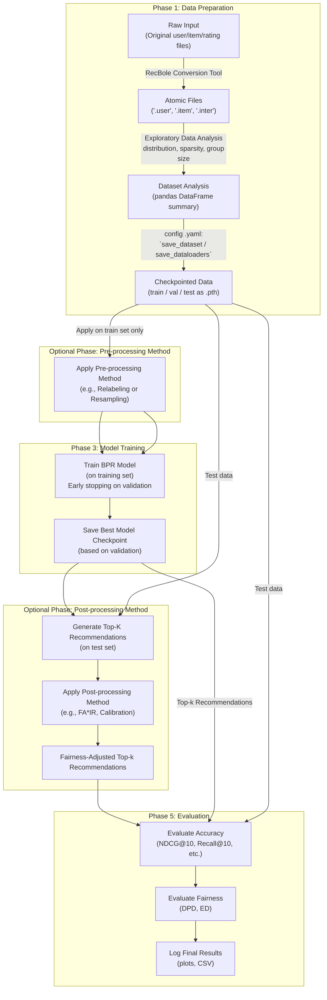

# Experiment  Pipelines on Mitigation Methods

```mermaid
flowchart TD
    %% === Phase 1: Data Preparation ===
    subgraph "Phase 1: Data Preparation"
        A1["Raw Input<br/>(Original user/item/rating files)"]
        A2["Atomic Files<br/>('.user', '.item', '.inter')"]
        A3["Dataset Analysis<br/>(pandas DataFrame summary)"]
        A4["Checkpointed Data<br/>(train / val / test as .pth)"]

        A1 -->|RecBole Conversion Tool| A2
        A2 -->|Exploratory Data Analysis<br/> distribution, sparsity, group size| A3
        A3 -->|config .yaml:<br/>`save_dataset / save_dataloaders`| A4
    end

    %% === Phase 2: Pre-processing Method ===
    subgraph "Optional Phase: Pre-processing Method"
        P1["Apply Pre-processing Method<br/>(e.g., Relabeling or Resampling)"]
        A4 -->|Apply on train set only| P1
    end

    %% === Phase 3: Model Training (shared) ===
    subgraph "Phase 3: Model Training"
        T1["Train BPR Model<br/>(on training set)<br/>Early stopping on validation"]
        T2["Save Best Model Checkpoint<br/>(based on validation)"]
        P1 --> T1
        T1 --> T2
    end

    %% === Phase 4: Post-processing Method ===
    subgraph "Optional Phase: Post-processing Method"
        Q1["Generate Top-K Recommendations<br/>(on test set)"]
        Q2["Apply Post-processing Method<br/>(e.g., FA*IR, Calibration)"]
        Q3["Fairness-Adjusted Top-k Recommendations"]

        T2 --> Q1
        A4 -->|Test data| Q1
        Q1 --> Q2
        Q2 --> Q3
    end

    %% === Phase 5: Evaluation ===
    subgraph "Phase 5: Evaluation"
        E1["Evaluate Accuracy<br/>(NDCG@10, Recall@10, etc.)"]
        E2["Evaluate Fairness<br/>(DPD, ED)"]
        E3["Log Final Results<br/>(plots, CSV)"]


        Q3 --> E1
        E1 --> E2
        E2 --> E3
    end

    %% === Connecting Pre-processing path ===
    P1 --> T1
    T2 -->|Top-k Recommendations| E1
    A4 -->|Test data| E1
    
```

